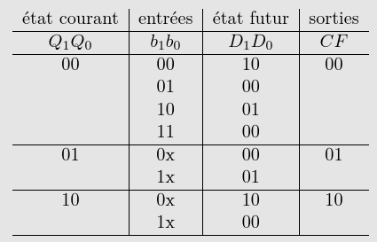

% Archi
% Ensimag

# Bases

**Complément à 2**: $x = -x_{n-1}\times 2^{n-1} + \sum_{n-2}^0 x_i \times 2^i$.

* `1111 = -8+4+2+1 = -1`
* `1000 = -8+(0*4)+(0*2)+1 = -8`

$x \in [-2^n-1, 2^{n-1}-1]$ en C2.

## Expressions booléenes

**Sum of product**: $f$ sous forme sop, $f=(\bar{x}\cdot y)+(x\cdot y)$.

x|y|f|sop
-|-|-|-:
0|0|0|
0|1|1|$\bar{x}\cdot y$
1|0|0|
1|1|1|$x\cdot y$

**De Morgan**: 

- $\overline{x \cdot y}$ = $\bar{x} + \bar{y}$
- $\overline{x + y}$ = $\bar{x} \cdot \bar{y}$

## Karnaugh


**Idée**: Minimisation des expressions par groupement. Les groupes peuvent passer d'un coté de la table à l'autre. Seulement un bit doit différer entre chaque colonne/ligne (`01 -> 11 -> 10 -> 00`)

Ici, $f = \bar{a}\bar{b}c + a\bar{c}$.

# Circuits combinatoires

**Circuit séquentiel:** [qui repose sur la mémoire](https://fr.wikipedia.org/wiki/Logique_s%C3%A9quentielle). Les résultats dépendent des valeurs calculées précédément. L'élément de base est la bascule D. Les **éléments séquentiels** mémorisent la valeur d'un signal.

## Bascule D
**Freq max de fonctionnement**: freq clock au dela de laquelle il existe un chemin entre 2 bascules ayant un temps de propagation supérieur à la période de l'horloge.

Ce chemin "limite" s'apelle **chemin critique**.

**Front montant** (noté 0->1): le passage de 0 à 1 d'un signal.

Deux façons de faire une basc D: avec *porte AND* et *mux*.


Souci de la méthode porte AND: si WE est en front montant quand CK est à 1, alors on va ré-échantilloner. Il faudra donc garantir que WE ne passe jamais en 0->1 quand CK est à 1. 

La deuxième solution est plus "sécurisée" parce que l'on échantilonne que quand CK est 0->1 et WE est 1. (C'est synchronisé sur la clock)

## Multiplexeur (ou mux)

Mux 1 bit 2 -> 1:


Pour faire des mux plus grands, on assemble *récursivement*. On peut passer de `n -> 2n`.

# Synthèse d'automate
Exemple table de transition:



On peut écrire symboliquement également (avec les lettres aux lieux des bits). La table doit être complete mais pas obligé de décrire chaque cas, par exemple ici avec le 0x.

**Machine à état**: décrit synthétiquement une logique/circuit séquentiel. Composition:
- États
- Transitions: étiquetées par des conditions. 
- Actions: visible en sortie.

*Deux types* d'automate:
- **Moore**: Fonction de transition dépend uniquement de l'étant courant. ($S \rightarrow O$)
- **Mealy**: Fonction de tansition dépend de l'état courant **et** de l'entrée actuelle ($I \times S \rightarrow O$).
  
On utilise uniquement Moore dans le cours.

Moore: sortie associée aux états.
Mealy: sortie associée aux transitions.

Les sorties sont écrites avec un slash: $état_0 / s_0$

## Types d'encodage des états
**Encodage 1 parmi n:** Un état correspond à un unique bit.

**Encodage logarithmique**: Taille totale $b = \lfloor log_2(n)\rfloor$. On prend un encodage qui minimisera les équations.

Il faut à la fois un encodage pour les états **et** un encodage pour les sorties.

Utiliser Karnaugh derrière pour trouver les équations simplifiées si on nous demande.

# Conception PC/PO d'un circuit

Valeurs des signaux dans le processeur du TP


**PC**: partie contrôle, je fais les opérations.
**PO**: partie opérative, contrôle du flux.

Pour un état de la PO, chaque signal peut prendre la valeur $1$, $0$ ou $\phi$ (= peu importe sa valeur).

## Optimisation

**Parralélisme**:

```py
x = x - e
y = b
==>
(x, y) = (x - e, b)
```
Ne marche que quand les opération sont parralélisables (pas de dépendances). `x = x - y; y = y + x` non parralélisable.

**Câblage des conditions**: On regroupe plusieurs états en un seul.

```py
if x >= e:
  y = b;
else:
  y = y<<1;
==>
y = (x >= e) ? b : y<<1;
```

Implémentation:


# Conception de processeur

IR contient l'instruction courante, PC pointe sur l'adresse de l'instruction suivante dans notre processeur.

Quand je fetch, je récupère l'instruction dans IR et je fais avancer PC.

`ld AD, rd`: ou stocker l'adresse? **Dans notre processeur**, on la stocke après l'instruction. L'adresse étant sur 16 bits et une instruction sur 8 bits, on fait avancer PC deux fois.

On peut faire le choix de stocker la constante dans l'instruction si la constante est assez petite par exemple.

**Extension de signe**: on garde le bit de poids fort. Pour une constante de 4 a 8 bits: `1001 -> 1111 1001`.

**Faire des sauts**: on modifie PC et ca saute. On peut lire la nouvelle valeur de PC d'une constante ADR stockée après l'instruction jmp (`PC = MEM[PC] = ADDR`). Pour faire une double indirection (`PC = MEM[MEM[PC]]`) il faut qu'on puisse lire d'un registre.