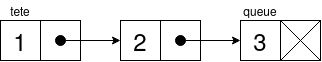
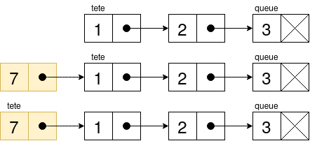
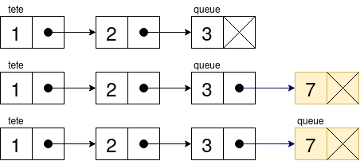
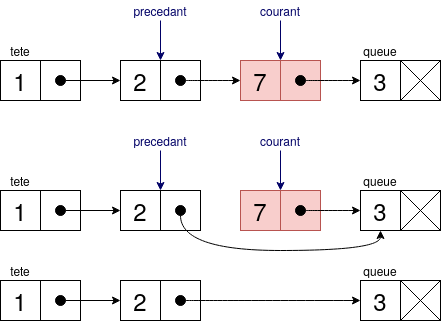
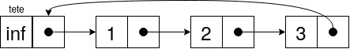
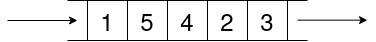
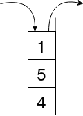

% BPI
% Ensimag

# Structures de données et ADT 

## Liste chainée simple



- **Avantages:** insertion en début/fin de liste rapide, restructuration facile par rapport à un tableau.
- **Inconvénients:** parcours O(n), parcours à l'envers difficile.
- *ADT (abstract data type, type abstrait)*: liste.
- *SDD (structure de données)*: liste chainée.

Elle s'appelle liste chainée simple parce qu'il n'y que le sens avancer. La double va dans les deux sens, avancer et reculer.

```py
class Cellule:
    def __init__(self, valeur, suivant=None):
        self.valeur = valeur
        self.suivant = suivant

class ListeSimplementChainee:
    def __init__(self):
        self.tete = None
        self.queue = None
        self.taille = 0
```
### Parcours de liste

On peut tout mettre dans un générateur, afin de pouvoir parcourir la liste chaînée avec un `for` dans le reste des fonctions. On évite aussi la création d'un tableau intermédiaire.

```py
def recupere_cellules(liste_chainee):
    cellule_courante = liste_chainee.tete
    while cellule_courante:
        yield cellule_courante
        cellule_courante = cellule_courante.suivant
```

### Ajout au début



On rattache la liste à une nouvelle cellule, et elle devient la tête. Temps O(1).

```py
def ajoute_en_tete(liste_chainee, valeur):
    liste_chainee.tete = Cellule(valeur, liste_chainee.tete)
    if liste_chainee.taille == 0:
        liste_chainee.queue = liste_chainee.tete

    liste_chainee.taille += 1
    return liste_chainee
```

### Ajout en fin



La cellule en queue pointe vers une nouvelle cellule. Temps O(1).
```py
def ajoute_en_queue(liste_chainee, valeur):
    nouvelle_cellule = Cellule(valeur)
    if liste_chainee.taille == 0:
        liste_chainee.tete = nouvelle_cellule
    else:
        liste_chainee.queue.suivant = nouvelle_cellule
        liste_chainee.queue = nouvelle_cellule

    liste_chainee.taille += 1
    return liste_chainee
```

### Suppression



On aura besoin d'un pointeur sur le précedant pour "relier" la chaîne. On utilise `courant` pour identifier la cellule à supprimer et `precedant` pour relier. On relie en utilisant le suivant de la cellule à supprimer.

La suppression demande un parcours de liste en O(n).

```py
def supprime_suivant(liste_chainee, cellule):
    if cellule:
        supprimee = cellule.suivant
        cellule.suivant = supprimee.suivant
    else: # Pas de précédant => on est en tête de liste
        supprimee = liste_chainee.tete
        liste_chainee.tete = supprime.suivant

def supprime(liste_chainee, valeur):
    precedant = None
    courant = None

    for cellule in recupere_cellules(liste_chainee):
        courant = cellule
        if courant.valeur == valeur:
            supprime_suivant(liste_chainee, precedant)

        precedant = courant

    return liste_chainee
```

## Liste chainée circulaire avec sentinelle



La liste boucle sur elle même, et on a une cellule sentinelle pour marquer à la fois le début et la fin de la liste.

C'est un élément bidon, mais pratique: au lieu de gérer les cas début de liste/fin de liste comme au dessus, quand on boucle ça marche tout le temps. Le reste c'est la même chose.

### Parcours

```py
def recupere_cellules(liste_chainee):
    cellule_courante = liste_chainee.tete.suivant
    while cellule_courante is not liste_chainee.tete:
        yield cellule_courante
        cellule_courante = cellule_courante.suivant
```

## File (ADT)


- **Avantages**: first-in, last-out, comme une queue.
- *SDD*: peut se faire avec une liste chainée.

Dessus, on aura des methodes `enqueue()` pour l'ajout, `dequeue()` pour récupérer.

## Pile (ADT)


- **Avantages**: first-in, first-out, comme un tas de papiers.
- *SDD*: peut se faire avec une liste chainée aussi.

Dessus, on aura des methodes `push()` pour l'ajout, `pop()` pour récupérer.

# Astuces

Des petits trucs pour aller plus vite en TP et contrôle.

## Format string

- Pour faire des string rapidement. Tout entre `{}` est converti en string.
- Marche pour des classes avec un `__str__`.

```py
class Cellule:
    """Une cellule d'une liste."""

    def __init__(self, valeur, suivant=None):
        self.valeur = valeur
        self.suivant = suivant

    def __str__(self):
        return f'<Cellule valeur={self.valeur}>'


cell = Cellule(10)
print(f'cell: {cell}')
```
```
cell: <Cellule valeur=10>
```

## `enumerate`

- Permet de remplacer les `while` avec accès au `i` direct.
- On pourra casser la boucle avec `break`.
- Marche pour tous les iterables.

Avec un tableau:
```py
tableau = ['a', 'b', 'c']
for i, valeur in tableau:
    print(f'Valeur {i}: {valeur}')
```
```
Valeur 0: a
Valeur 1: b
Valeur 2: c
```

Avec un générateur:
```py
def gen_jours():
    """Générateur qui renvoie les jours de travail de la semaine."""
    yield "Lundi"
    yield "Mardi"
    yield "Mercredi"
    yield "Jeudi"
    yield "Vendredi"

for i, jour in enumerate(gen_jours()):
    print(f'Jour {i}: {jour}')

    if i == 2:
        break
```
```
Jour 0: Lundi
Jour 1: Mardi
Jour 2: Mercredi
```

## `str.join()`

- Utile pour faire des chaines et des tableaux rapidement.
- Le string à gauche est la "glue" qui vient entre chaque élement.
```py
print(" | ".join(['a', 'b', 'c', 'd', 'e']))
print("\n".join(["ligne 1", "ligne 2", "ligne 3"]))
```
```
a | b | c | d | e
ligne 1
ligne 2
ligne 3
```